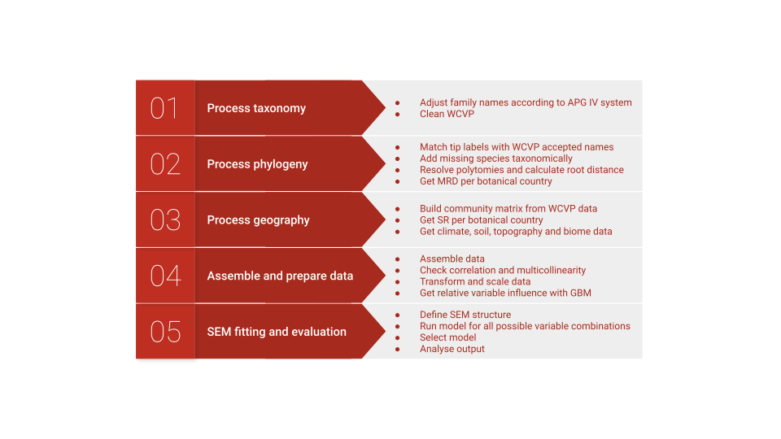

# Global plant diversity project

## About

Using the World Checklist of Vascular Plants (WCVP, [1]) taxonomy and distribution data, and phylogeny [2] to spatially analyze environmental (climate, soil, topography) and evolutionary (diversification rates) drivers of global plant diversity (species richness) patterns.

[1] WCVP, World Checklist of Vascular Plants, version 2.0. Facilitated by the Royal Botanic Gardens, Kew (2021) (Retrieved 21 June 2020)

[2] S. A. Smith, J. W. Brown, Constructing a broadly inclusive seed plant phylogeny. Am. J. Bot. 105, 302–314 (2018)

## Scripts

All scripts are stored in *publish_scripts* folder. To go through the analysis step by step, open *master_analysis.R*, which sources all other scripts required to repeat analysis. The header in the master script contains system requirements and execution time information.

Script                          | Job
--------------------------------|--------------------------------------------------------------------------
add_species_server_version.R    | Adding species taxonomically to a phylogeny
APG_family_lookup.R             | Adjust family names for APG 4 System [3]
assemble_dataset.R              | Assemble final data set (environmental, evolutionary and species richness data)
clean_semplot_functions.R       | Helper functions for cleaner structural equation model plots
common_format_creator_SB.R      | Builds common format for taxonomic names from GBIF data to feed into the taxonomy matcher
data_prep_and_checks.R          | Get correlations, variable importance analysis, distribution + transformation where necessary, multicolinearity tests, scaling data
functions.R                     | Functions called mostly in phylogeny processing and SEM anaylsis and spatial autocorrelation correction
get_biomes.R                    | Process biome data
get_climate.R                   | Process climate data
get_soil.R                      | Process soil data
get_topography.R                | Process elevation data for terrain ruggedness index
match_data.R                    | Get tip label name sources, match NCBI-based tip labels with WCVP accepted taxa IDs
match_data_part2.R              | Match GBIF-based tip labels with WCVP accepted taxa IDs. Replace tip labels with WCVP accepted IDs
mod_selection_SEM.R             | Building Structural Equation Models with possible variable combinations, collecting models stats
mod_selection_SEM_analysis.R    | Get stats from model selection, manual model adjustments
phylostruct.R                   | Computing mean root distance for TDWG level 3 units 
process_geography.R             | Building presence matrix for WCVP accepted taxa in TDWG level 3 units
resolve_polytomies.R            | Repeatedly resolve polytomies in phylogeny and record average root distance for each tip
sem_results_further_analysis.R  | Inspect tructural equation model path coefficients, compare with univariate regressions, spatial autocorrelation anaylsis, figures and maps 
taxonomic_matcher.v.1.4.R       | Match taxonomic names with WCVP accepted IDs
WCP_cleanup.R                   | Data cleaning

[3] APG IV. An update of the Angiosperm Phylogeny Group classification for the orders and families of flowering plants: APG IV. Botanical Journal of the Linnean Society, 2016, 181, 1–20.

### Reproducibility and completeness
Please note that for the sake of reproducibility, we include *all* scripts. That includes also scripts processing large primary data files which are not included in the supplement for size reasons (i.e. CRU TS, wordclim, soil). Results from processing these files are included however. To repeat these steps, the necessary data can be obtained as free downloads (link in description part).

## Data
Primary data are files obtained online / by collaborators. Processed data are files which are produced during the analysis steps and stored to shorten execution time for later analysis steps and to keep work space small. Files are listed with description here: [data description](data_description.md).

Large data files that can be freely accessed online (i.e. CRU TS, WordClim) are not part of the supplement but listed with version number and information how to obtain them.

**All steps are recorded, the final data set used for maps, figures and structural equation modeling is *sem_input_data.rds***.

### Primary data

File                        | Description
---------------------------- | --------------------------------------------------------------------------
checklist_names.txt         | Text file containing World Checklist of Vascular Plants taxonomy, taxon status, unique ID and synonyms
checklist_distribution.txt  | Text file containing World Checklist of Vascular Plants taxon presence data in botanical countries
ALLMB.tre		                | Phylogney with GenBank and Open Tree of Life taxa with a backbone provided by Magallón et al. (2015). From Smith & Brown 2018
GBMB.tre			              | Phylogney with GenBank taxa with a backbone provided by Magallón et al. (2015). From Smith & Brown 2018. Used to identify taxa with molecular information
ott.rds                     | Open Tree of Life taxonomy file (.rds version of taxonomy.tsv, Version: 3.0. Available on https://tree.opentreeoflife.org/about/taxonomy-version/ott3.0). Used to identify source for tip label name (NCBI or GBIF)
fin_species_match_NCBI.rds  | List with taxonomy matching results for NCBI phylogeny tip labels with WCVP IDs
gbif_all.rds                | Download of taxonomic information from GBIF for GBIF phylogeny tip labels 
bryophyta.csv               | List of mosses and liverworts families (Bryophyes), available on theplantlist.org/browse
fern_list.txt               | List of fern and fern allies families (Pteridophytes), available on theplantlist.org/browse
soil_raster_layer_000832.tif| Soil raster layer with most probable soil types, available on https://files.isric.org/soilgrids/latest/data/wrb/MostProbable.vrt and saved as geotiff with lower resolution for reasonable computation time
shapefile_biomes/wwf_terr_ecos.*	| Shapefile with terrestrial ecoregions of the world (biomes). Available on https://www.worldwildlife.org/publications/terrestrial-ecoregions-of-the-world
shapefile_bot_countries/level3.*   | Shapefile with polygons for all 369 TDWG level 3 units

 
### Primary data not included but online:
File                            | Description
---------------------------- | --------------------------------------------------------------------------
wc2.1_30s_elev.tif		          | WorldClim elevation data, available on https://biogeo.ucdavis.edu/data/worldclim/v2.1/base/wc2.1_30s_elev.zip
cru_ts4.04.1901.2019.pet.dat.nc | CRU TS v. 4.04, available on https://catalogue.ceda.ac.uk/uuid/89e1e34ec3554dc98594a5732622bce9.  Free account required for download.
cru_ts4.04.1901.2019.tmp.dat.nc | see above 
cru_ts4.04.1901.2019.pre.dat.nc | see above

### Processed data
Includes intermediate results built during analysis, allowing processing of later steps without starting from scretch.

File                        | Description
---------------------------- | --------------------------------------------------------------------------
apg_wcp_jun_20.rds          | .rds file version of checklist_names.txt file for faster loading 
apg_wcp_jun_20_clean.rds	  | World Checklist of Vascular Plants taxonomy working file. Cleaned and family names adjusted for the latest accepted version based on the APG IV (2016) system
SB_tip_labels.rds		        | Non-NCBI based tip labels in ALLMB.tre
fin_species_match_GBIF.rds	|  List with taxonomy matching results for GBIF phylogeny tip labels with WCVP IDs
fin.rds			                | Tip labels in ALLMB.tre
allmb_matched_clean.tre	    | Phylogeny with original tip labels replaced with WCVP unique IDs
level3_mod.shp              | Shapefile with polygons for all 369 TDWG level 3 units and buffer around small islands
allmb_matched_added_species_clean.tre | Phylogeny used in analysis with WCVP tip labels and taxonomically added species
comm_April2021.rds		      | Community matrix containing World Checklist of Vascular Plants taxon presence data in botanical countries, using WCVP unique IDs
polytomie_RD_results_Apr21.rds | Mean root distances for each taxon
mrd_Apr2021.rds		          | Mean root distances for each TDWG level 3 unit
soil.rds 			              | Number of soil types per TDWG level 3 unit
topography.rds			        | Terrain ruggedness index for each TDWG level 3 unit
biomes_olson.rds		        | Biome types for each TDWG level 3 unit
climate.rds			            | Mean and standard deviations of climatic variables for each TDWG level 3 unit
cru/.*                      | Processed CRU climate data
shp_object_fin_analysis.RDS	| Assembled dataset incl. species richness, mean root distance, environmental variables
sem_input_data.rds		      | Final dataset without incomplete cases
mod_selection_Apr2021.RData	| A list called "temp" with model selection results and stats from each 1046429 model runs 
all_models.RData		        | Processed model selection results and best models
best_model.RData		        | final structural equation model lavaan object

## Analysis workflow

  

  